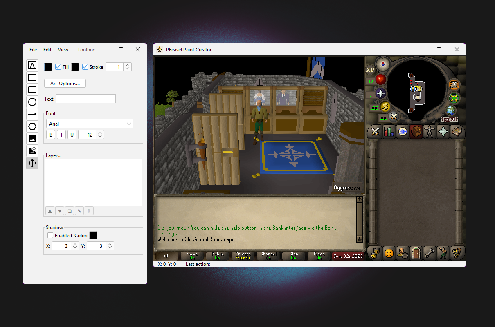
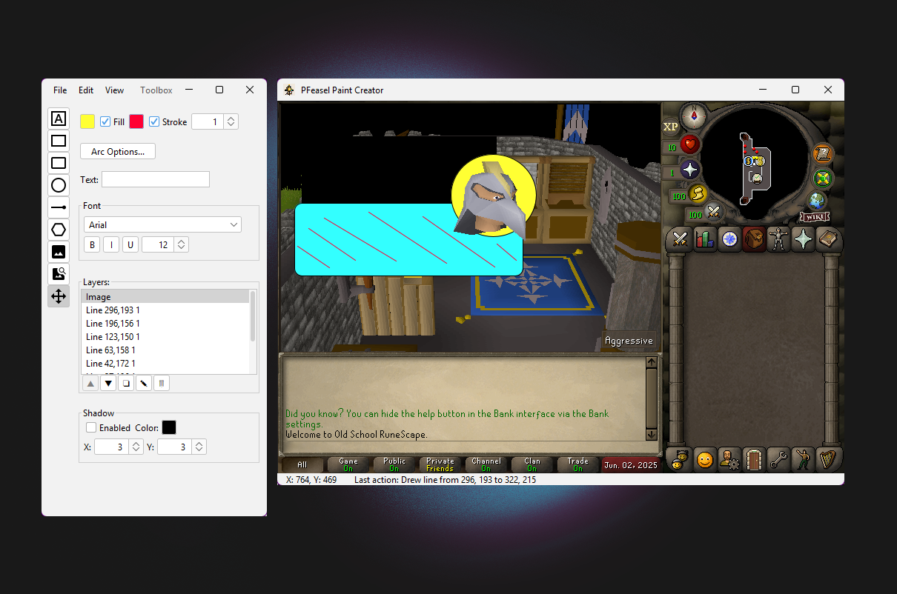

# PF Easel

## Description
PF Easel is a Java Swing-based 2D vector graphics application. It allows users to draw various shapes, add text and images, manipulate these elements on a canvas, and manage them through a layer system.



## Features
* **Drawing Tools**: Rectangle, Rounded Rectangle, Circle, Line, Polygon, Text.
* **Image Support**: Load images from local files or URLs onto the canvas.
* **Element Manipulation**:
    * Select, Move, Duplicate, Delete, Rename elements.
    * Reorder elements (bring to front, send to back, etc.) via a layers list.
* **Properties Toolbox**:
    * Select active drawing tool.
    * Control fill color, stroke color, and stroke width.
    * Adjust font properties (family, size, bold, italic, underline) for text elements.
    * Set arc dimensions for rounded rectangles.
    * Configure shadow properties (enable, color, offset X/Y).
    * Manage layers (view list, reorder, duplicate, rename, delete).
* **Main Drawing Panel**:
    * Canvas for drawing and interacting with elements.
    * Status bar displaying mouse coordinates and last action performed.
* **File Operations**:
    * New (prompts to save unsaved changes).
    * Open (supports `.pfd` custom format).
    * Save (supports `.pfd` custom format).
    * Save As... (supports `.pfd` custom format).
    * Exit (with confirmation dialog).
* **Visual Aids**:
    * Toggleable grid display.
    * Snap-to-grid functionality.
    * Toggleable "RS Interface" overlay.
    * Toggleable anti-aliasing for smoother rendering.
* **Undo/Redo**: Comprehensive undo/redo support for most drawing and manipulation actions.
* **Generate Code**: Generate vanilla Java2D code for your drawing (see File > Generate Code).



## How to Build and Run

### Prerequisites
* Java Development Kit (JDK) 11 or newer.
* [Maven 3.3.0](https://maven.apache.org/)

### Steps

1. **Clone the Repository**:
    ```bash
    git clone https://github.com/rroarings/pfeasel.git
    cd pfeasel-paint-creator
    ```
2. **Build with Maven**:
    ```bash
    mvn clean package
    ```
    This will create a runnable JAR file in the `target/` directory (e.g., `pfeasel-paint-creator-1.0-jar-with-dependencies.jar`).
3. **Run the Application**:
    ```bash
    java -jar target/pfeasel-paint-creator-1.0-jar-with-dependencies.jar
    ```


## How to Use

* Select drawing tools from the toolbox window
* Adjust element properties (colors, stroke, font, shadow) using the controls in the toolbox.
* Line color is adjusted from the <strong>Stroke</strong> color option.
* Draw elements directly on the main canvas.
* Manage drawing elements as layers using the "Layers" list in the toolbox.
* Use the "File" menu for creating new drawings, opening existing ones, saving your work, or exiting the application.
* Use the "Edit" menu for Undo and Redo actions.
* Toggle visual aids like the grid or anti-aliasing via the "View" menu in the toolbox.
* Use "Generate Code..." from the File menu to export Java2D code for your drawing.

## File Format

* Drawings are saved in a custom `.pfd` format.
* Only open `.pfd` files created by this application.

## Dependencies

* [FlatLaf](https://www.formdev.com/flatlaf/) (modern look and feel)
* [SLF4J](https://www.slf4j.org/) (logging API)

## Project Structure & Open Source Readiness

* Follows standard Maven directory layout (`src/main/java`, `src/main/resources`).
* All resources (icons, images) are included in the JAR and loaded from the classpath.
* Ready for open source contributions and issue tracking.

## Future Enhancements

* More advanced shape tools (e.g., freehand drawing, bezier curves).
* Multi-element selection and group operations.
* Zoom and pan capabilities for the canvas.
* Export drawings to common image formats (e.g., PNG, JPG, SVG).
* Gradient fills and more advanced styling options.

## Contributing

Contributions are welcome! Please open an issue or submit a pull request.

## License

[MIT License](LICENSE)

## Attributions

Tool icons are sourced from the following open source icon sets via [Iconify](https://icon-sets.iconify.design/):

- [Game Icons](https://icon-sets.iconify.design/game-icons/)
- [Hugeicons](https://icon-sets.iconify.design/hugeicons/)
- [Material Symbols](https://icon-sets.iconify.design/material-symbols/)
- [Material Design Icons](https://icon-sets.iconify.design/mdi/)
- [Unicons](https://icon-sets.iconify.design/uil/)

---

*For questions or support, please open an issue on GitHub.*